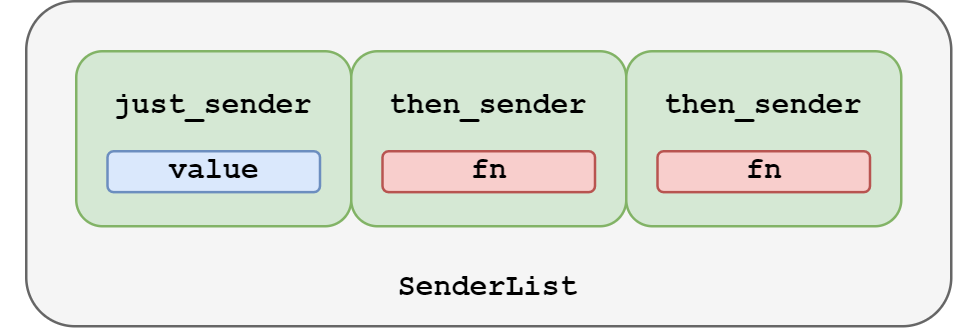
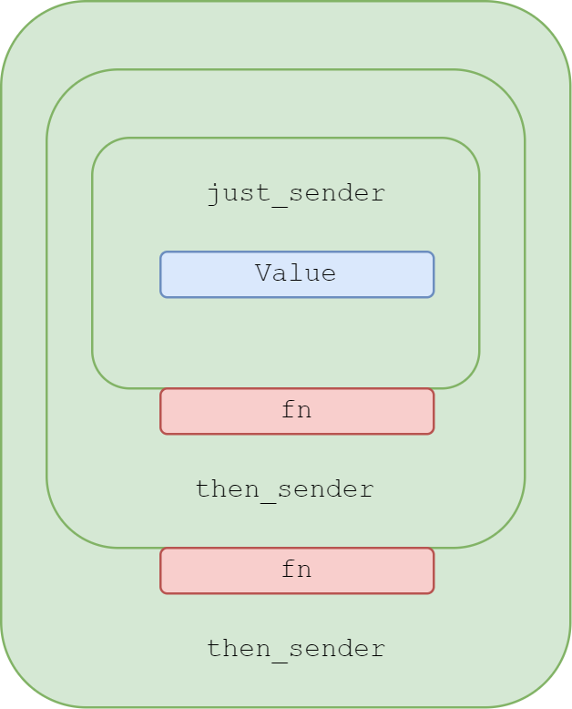

# 六 “Here, to welcome the new hunter.”

我们回望第一节的例子：

``` C++
// ...
    sender auto s = just(in_value) | then([](int i) {return i + 42;});
    sync_wait(s).value();
// ...
```

仅从字面意义上来说，代码行`s = ...`构造了一个*数据管道*的*表达*，当这个*数据管道*被*执行*的时候，数据从`just()`发出，传递给`then()`，然后`then`会调用一下参数上的匿名函数进行加工并向后推送。

对于上位者`std::execution`而言，数据管道中的每一截，`just(...)`也好，`then(...)`，都称为`Senders`。所以从用户的视角看，数据就是从一个`Sender`发送到另一个`Sender`，并没有`Receiver`什么事。所以我们先讨论`Senders`，稍后再讨论`Receiver`。

如果我们的信息只给这么多，由你来实现这一想法。那么按照普通C++程序的套路，它的实现可能是：

``` C++
Sender just(value) { ... }
Sender then(Fn) { ... }

SenderList operator | (SenderList snds, Sender& s) {
    snds.append(s);
    return std::move(snds);
}
```

其结构类似于下图：



或者如果`sender`自身是一个链表结构的话，也可以这样：

``` C++
Sender& operator | (Sender& currentSender, Sender& nextSender) {
    currentSender.connect(nextSender);
    return currentSender;
}
```

那么对应的结构大概长这样：


因为`currentSender`需要把数据传递给`nextSender`，这个数据类型可能是任意的。如果`Sender`是一个固定类型而缺乏泛型支持，就意味着前一个`Sender`无法向后一个`Sender`传递一个强类型数据。数据在传递的过程中，需要进行**类型擦除**，比如罪恶的`void*`或者不那么罪恶的`std::any`。

这并不符合C++教会上层人士对上位者们的信仰。类型擦除存在两个问题，一是类型的正确性无法在编译期得到保证，即便`std::any`等现代类型擦除的实现可以在运行时进行检查；二是前后两段本来强相关的代码被分离开了，使得编译器无法将两段代码整合在一起进行优化，就如同我们在*表达式求值*这个例子中所看到的那样。

为了让类型可以在`Sender`之间进行传递，`std::execution`的实现`libunifex`和`stdexec`都选择使用嵌套将多个`Senders`连接起来：

``` C++

template <typename T>
just_sender<T> just(T value) { ... }

template <typename Sender>
then_sender<Sender, Fn> then(Sender snd, Fn func) { 
    return then_sender<Sender, Fn>(snd, func);
}

then(
    just(in_value),
    [](int i) {return i + 42;}
);

```

所以链式结构在`std::execution`中，表达为下面这样：



当然最外层的类型会变成类似于

``` C++
then_sender<
  then_sender<
    just_sender<T>
    , Fn>
  , Fn> s;
```

这种复杂的嵌套结构。虽然看着有些反直觉，但是它确实是个链式结构。链条的头部在最内层，尾部在最外层。在使用的时候，既可以通过递归的方式正向或者逆向遍历链表，也可以当成一个整体去干点别的什么事。这样，每一个后继节点都拥有它之前的节点的完整类型信息，彻底解决了类型传递的问题。

由此，我们获得了上位者的外观 —— 即*表示*部分。接下来要解决的，就是从*表示*变成可以*执行*的结构的过程。

初始示例在执行了第二行 `sync_wait(s).value()`，之后就可以获得结果。显然，使得祷告生效的秘密就存在这个`sync_wait`之中。

我们来看看这个`sync_wait`到底做了什么。将`libunifex`或`stdexec`中的对应代码的简化一下，会得到类似这样的代码：

``` C++
template <typename Sender>
auto sync_wait(Sender&& sender) {
  auto ctx = event_loop();
  auto rcv = sync_wait_receiver{ctx};
  auto op = sender.connect(receiver);
  op.start();
  ctx.run();
}
```

这里我们先抛开`event_loop`，整个函数有三条脐带，连接了上位者与猎人的梦境：
1. 构造了一个`receiver`对象。这里`receiver`的具体类型是`sync_wait_receiver` —— 这里终于出现`receiver`了。我们稍后将会展示它的作用和结构。
2. `Sender`必须要有一个成员函数叫`connect`，它接受一个`receiver`。调用它，获得一个返回值`op`。注意：和之前所叙述的一些方案不同，`receiver`并不会直接或间接地接驳到`senders`上。关于`receiver`的意义和用法我们会在下一篇章揭示。
3. 这个`connect`函数所返回的对象拥有一个`void start()`成员函数。注意，这里返回值`op`的类型是个泛型。在`std::execution`中，这些拥有一个`void start()`成员函数的类型，称之为符合`operation_state` *concept*。

这个`operation_state`，可以认为保存了我们变换之后的执行图。当`start()`被调用的时候，就预示着祷告生效，上位者真的莅临了。

那么，三个关键的问题呼之欲出：
1. 聆听了我们祷告的上位者的代理人`receiver`究竟是什么？
2. `sender.connect(receiver)` 到底做了什么？
3. `operation_state` 究竟是一种怎样的存在？

我们会在下一章揭晓。

> 我们在此迎接新的猎手踏入此地。